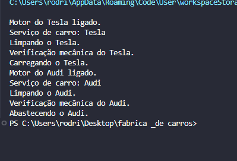

<!DOCTYPE html>
<html lang="pt-br">
<head>
    <meta charset="UTF-8">
    <meta name="viewport" content="width=device-width, initial-scale=1.0">
    <meta name="description" content="Projeto de Padrão de Projeto Abstract Factory Method - Fábrica de Carros">
    <meta name="keywords" content="Abstract Factory, Design Pattern, Java, Fábrica de Carros">
    <meta name="author" content="Ana Alice Rodrigues">
</head>
<body>

<header>
    <h1>Fábrica de Carros - Padrão de Projeto Abstract Factory</h1>
    
</header>

    
Índice

    <ol>
        <li><a href="#sobre-o-projeto">Sobre o projeto</a></li>
        <li><a href="#parte-tecnica">Parte Técnica</a></li>
        <li><a href="#estrutura-dos-arquivos">Estrutura dos Arquivos</a></li>
        <li><a href="#casos-de-uso">Casos de Uso</a></li>
        <li><a href="#ferramentas">Ferramentas</a></li>
        <li><a href="#contato">Contato</a></li>
    </ol>

<section id="sobre-o-projeto">
    <h2>Sobre o projeto</h2>
    

        Este projeto exemplifica a implementação do padrão de projeto Abstract Factory para uma fábrica de carros. O objetivo é criar diferentes tipos de carros utilizando fábricas abstratas e concretas, permitindo a criação e o serviço de manutenção de carros de diferentes marcas.
    

</section>

<section id="parte-tecnica">
    <h2>Parte Técnica</h2>
    <ul>
        <li><strong>Linguagem de Programação:</strong> Java</li>
        <li><strong>Paradigma:</strong> Programação Orientada a Objetos (POO)</li>
        <li><strong>Padrão de Projeto:</strong> Abstract Factory</li>
    </ul>
</section>

<section id="estrutura-dos-arquivos">
    <h2>Estrutura dos Arquivos</h2>
    <ul>
        <li><strong>car/</strong>
            <ul>
                <li>Audi.java</li>
                <li>Car.java</li>
                <li>Tesla.java</li>
                <li>Toyota.java</li>
                <li>Volkswagen.java</li>
            </ul>
        </li>
        <li><strong>factory/</strong>
            <ul>
                <li>CarFactory.java</li>
                <li>CompanyCarFactory.java</li>
                <li>Factory.java</li>
            </ul>
        </li>
        <li><strong>client/</strong>
            <ul>
                <li>Client.java</li>
            </ul>
        </li>
    </ul>
</section>

<section id="casos-de-uso">
    <h2>Casos de Uso</h2>
    <ul>
        <li><strong>Criação de Carros:</strong> Através das fábricas, podemos criar diferentes tipos de carros como Tesla, Audi, Toyota e Volkswagen.</li>
        <li><strong>Serviço de Manutenção:</strong> As fábricas também oferecem serviços de manutenção para os carros criados, incluindo limpeza, verificação mecânica e abastecimento.</li>
    </ul>
</section>

<section id="ferramentas">
    <h2>Ferramentas</h2>
    <ul>
        <li></li>
        <li></li>
        <li></li>
    </ul>
</section>

<section id="contato">
    <h2>Contato</h2>
    <ul>
        <li></li>
    </ul>
</section>

</body>
</html>
